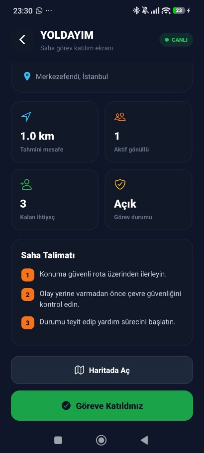
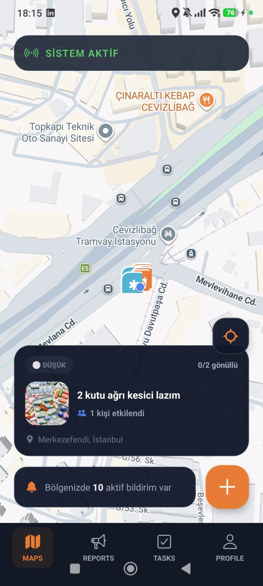
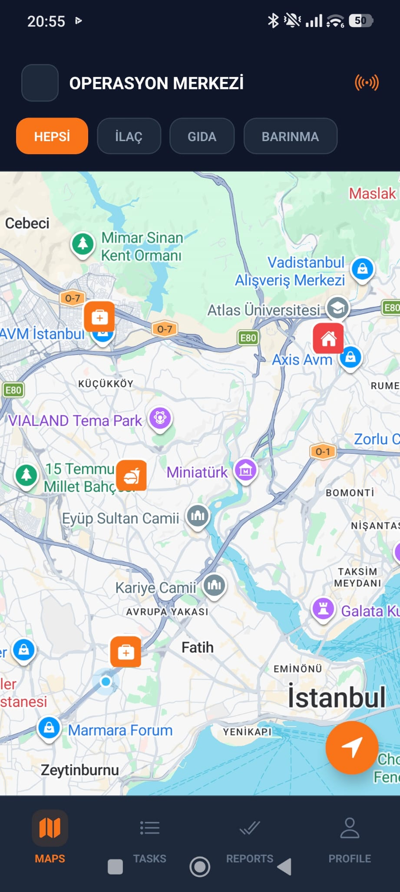
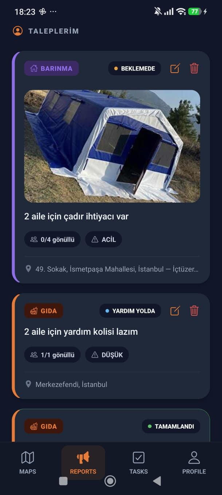
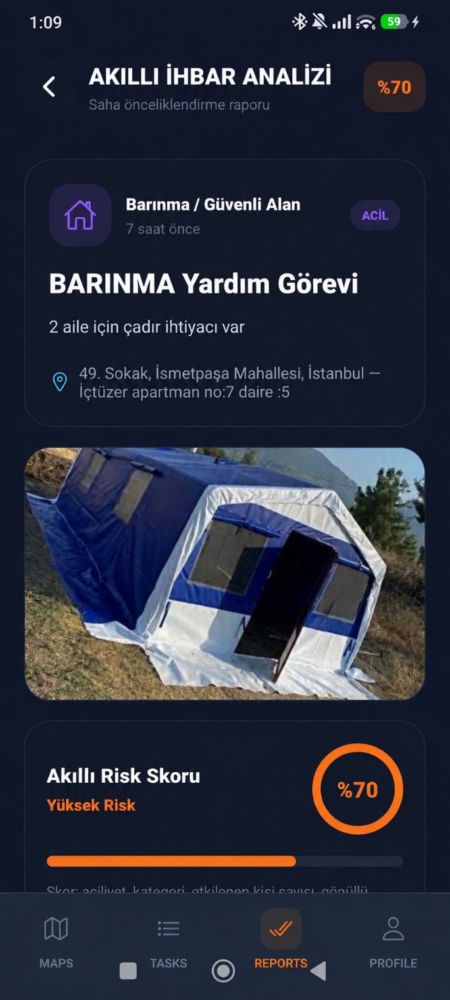
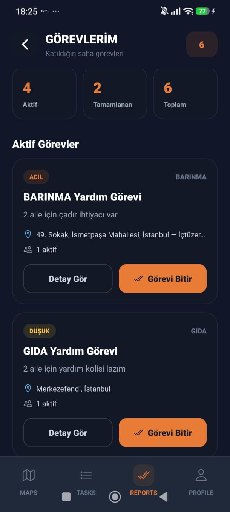
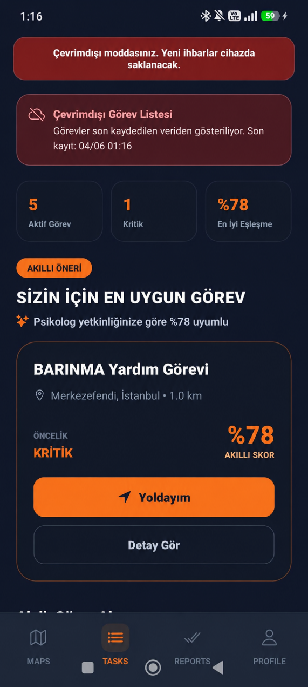
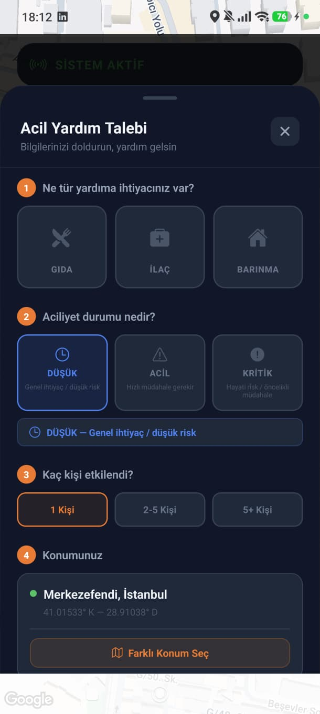
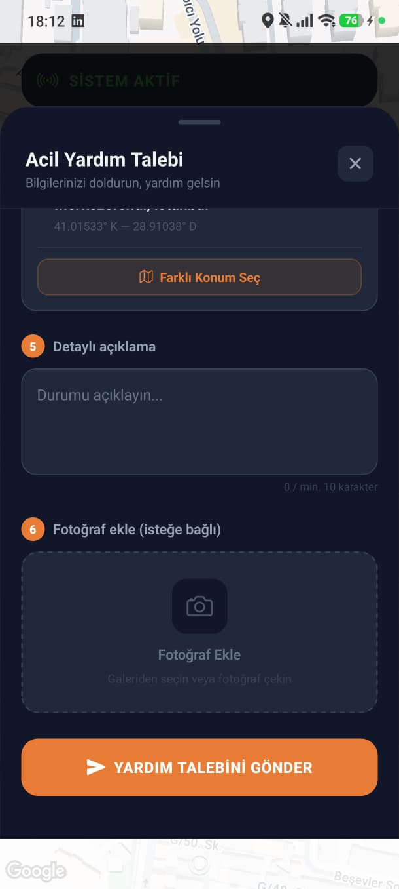
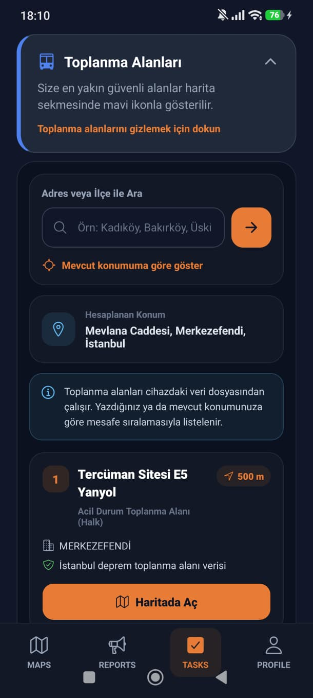

# Afet Yönetim Sistemi

  <strong>Afet durumlarında afetzedeler ile gönüllüleri aynı platform üzerinde buluşturan mobil koordinasyon ve yardım yönetim uygulaması.</strong>

  
  
  
  

### 📌 Proje Hakkında

Afet Yönetim Sistemi, afet sonrasında yardım ihtiyacı bulunan kişilerin taleplerini konum ve görsel bilgileriyle iletebilmesini, gönüllülerin ise bu talepleri harita ve görev ekranları üzerinden takip ederek uygun operasyonlara katılabilmesini amaçlayan mobil bir koordinasyon platformudur.

Uygulama; Firebase Authentication ve Cloud Firestore ile kullanıcı ve ihbar yönetimi, harita ve konum servisleri ile saha koordinasyonu, cihaz üzerindeki yerel depolama ve ağ durumu takibi ile çevrimdışı çalışma desteği ve görev önceliklendirmesine yardımcı olan akıllı skor mekanizması içerir.

Bu çalışma üniversite bitirme projesi kapsamında geliştirilmiştir.

### 🎯 Temel Amaç

Afet sonrasında iletişim ve koordinasyon süreçlerinde ortaya çıkabilecek gecikmeleri azaltmak ve yardım taleplerinin uygun gönüllülere daha hızlı ulaştırılmasını sağlamak.

### Çözüm Yaklaşımı

Hızlı İhbar Oluşturma: Yardım türü, aciliyet, etkilenen kişi sayısı, konum, açıklama ve isteğe bağlı fotoğraf bilgileriyle talep oluşturma.

Konum Tabanlı Koordinasyon: Kullanıcı konumunun alınması ve operasyonların harita üzerinde görüntülenmesi.

Gönüllü Görev Yönetimi: Uygun görevlere katılma, "Yoldayım" durumunu bildirme ve görevi tamamlama.

Çevrimdışı Dayanıklılık: Ağ bağlantısı olmadığında verilerin cihaz üzerinde tutulması ve bağlantı sağlandığında senkronizasyon.

Akıllı Önceliklendirme: İhbarların aciliyet, kategori, etkilenen kişi sayısı, mesafe ve gönüllü yetkinliği gibi bilgiler üzerinden değerlendirilmesine yardımcı olan skor ve öneri mekanizması.

Toplanma Alanları: İstanbul toplanma alanlarının cihazdaki veri dosyasından listelenmesi ve konuma göre sıralanması.

### 📱 Ekran Görüntüleri

### Gönüllü Görev Merkezi

  

### Afetzede Haritası

  

### Gönüllü Harita

  

### Taleplerim

  

### Akıllı İhbar Analizi

  

### Gönüllü Görevleri

  

### Çevrimdışı Mod

  

### İhbar Oluşturma

  
  

### Toplanma Alanları

  

## ✨ Temel Özellikler

### 👤 1. Afetzede Modülü

- Firebase Authentication ile kullanıcı kaydı ve giriş.
- Profil bilgilerinin görüntülenmesi ve güncellenmesi.
- Şifre sıfırlama.
- Otomatik konum alma.
- Yardım türü seçimi:
  - Gıda
  - İlaç
  - Barınma
- Aciliyet seviyesi seçimi:
  - Düşük
  - Acil
  - Kritik
- Etkilenen kişi sayısının belirtilmesi.
- Detaylı yardım açıklaması.
- Galeriden fotoğraf seçme veya fotoğraf çekme.
- Farklı konum seçebilme.
- Oluşturulan talepleri takip etme, düzenleme ve silme.

### 🙋 2. Gönüllü Modülü

- Operasyon haritası üzerinden yardım taleplerini görüntüleme.
- Konuma göre görevleri değerlendirme.
- Görev detaylarını inceleme.
- Göreve katılma.
- "Yoldayım" durumunu bildirme.
- Aktif görevi tamamlama.
- Tamamlanan görevleri takip etme.
- İhbar analizi ekranından saha taleplerini inceleme.
- Profil üzerinden kullanıcı bilgilerini yönetme.
- Gönüllü ve afetzede modu arasında geçiş.

### 🗺️ 3. Harita ve Konum

- React Native Maps ile etkileşimli harita.
- Expo Location ile cihaz konumunun alınması.
- Yardım taleplerinin harita üzerinde gösterilmesi.
- Konum bazlı mesafe hesaplama.
- İstanbul toplanma alanlarının harita üzerinde gösterilmesi.
- Kullanıcının konumuna veya arama kriterine göre toplanma alanlarının listelenmesi.

### 📡 4. Çevrimdışı Çalışma ve Senkronizasyon

Afet ortamında internet bağlantısının kesilebileceği göz önünde bulundurularak uygulamada çevrimdışı çalışma desteği tasarlanmıştır.

- `@react-native-community/netinfo` ile ağ durumu takip edilir.
- `AsyncStorage` ile cihaz üzerinde yerel veri saklanır.
- İnternet bağlantısı olmadığında yeni ihbarlar yerel kuyruğa alınır.
- Bağlantı tekrar sağlandığında bekleyen verilerin Firebase'e gönderilmesi hedeflenir.
- Kullanıcıya çevrimdışı mod hakkında bilgilendirme gösterilir.

### 🧠 5. Akıllı İhbar Analizi ve Öneri Mekanizması

Gönüllülere görev seçiminde yardımcı olmak amacıyla ihbarların önceliklendirilmesine yönelik bir skor ve öneri mekanizması kullanılır.

Değerlendirmede uygulamadaki ihbar bilgileri, aciliyet seviyesi, ihtiyaç kategorisi, etkilenen kişi sayısı, gönüllünün konumu ve mesafesi ile yetkinlik bilgileri gibi parametrelerden yararlanılır.

> Bu modül harici bir yapay zekâ API'sine dayalı değildir. Projede kullanılan akıllı skor ve öneri mekanizması, görevlerin önceliklendirilmesine ve gönüllü-görev eşleştirmesine destek olacak şekilde tasarlanmıştır.

### 🏕️ 6. Toplanma Alanları

- İstanbul toplanma alanlarının uygulama içerisindeki veri dosyasından listelenmesi.
- Konuma göre mesafe hesaplanması.
- En yakın alanların öncelikli olarak gösterilmesi.
- Toplanma alanının harita üzerinde açılması.
- İlçe veya adres üzerinden arama yapılabilmesi.

## 🛠️ Teknoloji Yığını

| Alan             | Teknolojiler                                   |
| ---------------- | ---------------------------------------------- |
| Mobil            | React Native 0.81.5                            |
| Framework        | Expo SDK 54                                    |
| Programlama Dili | JavaScript (ES6+)                              |
| Navigasyon       | Expo Router, React Navigation                  |
| Kimlik Doğrulama | Firebase Authentication                        |
| Veritabanı       | Cloud Firestore                                |
| Harita           | React Native Maps                              |
| Konum            | Expo Location                                  |
| Yerel Depolama   | AsyncStorage                                   |
| Ağ Durumu        | React Native NetInfo                           |
| UI / Animasyon   | Expo Linear Gradient, Reanimated, Vector Icons |
| Görsel Seçimi    | Expo Image Picker                              |
| Tarih İşlemleri  | date-fns, Day.js                               |

## 🧩 Proje Dizin Yapısı

afet-projesi/
├── app/
│ ├── afetzede/
│ │ └── afetzedePaneli.js
│ ├── gonullu/
│ │ ├── gonulluPaneli.js
│ │ ├── ihbarAnalizi.js
│ │ ├── operasyonHaritasi.js
│ │ ├── profil.js
│ │ └── yoldayim.js
│ ├── \_layout.js
│ ├── forgotPassword.js
│ ├── home.js
│ ├── index.js
│ ├── login.js
│ └── register.js
│
├── src/
│ ├── components/
│ │ ├── gonullu/
│ │ │ ├── aiRecommendation.js
│ │ │ ├── gonulluBottomTab.js
│ │ │ └── taskCard.js
│ │ ├── OfflineSyncManager.js
│ │ ├── bottomTab.js
│ │ ├── ihbarModali.js
│ │ ├── konumSecModal.js
│ │ └── registerInputs.js
│ ├── constants/
│ │ ├── ihbarConstants.js
│ │ └── theme.js
│ ├── data/
│ │ └── istanbulAssemblyAreas.json
│ ├── firebase/
│ │ └── firebaseConfig.js
│ ├── hooks/
│ │ ├── gonullu/
│ │ │ └── useFetchTasks.js
│ │ ├── useAuth.js
│ │ ├── useLocation.js
│ │ ├── useMedia.js
│ │ └── useNetworkStatus.js
│ ├── styles/
│ │ ├── afetzedeStyles.js
│ │ ├── gonulluStyles.js
│ │ ├── ihbarStyles.js
│ │ ├── loginStyles.js
│ │ └── registerStyles.js
│ ├── tabs/
│ │ ├── mapTab.js
│ │ ├── profileTab.js
│ │ ├── reportsTab.js
│ │ └── tasksTab.js
│ └── utils/
│ ├── geoUtils.js
│ └── offlineStorage.js
│
├── assets/
├── docs/
│ └── screenshots/
│ ├── afetzede-gorev-merkezi.jpg
│ ├── afetzede-harita.jpg
│ ├── afetzede-talepler.jpg
│ ├── gonullu-gorev-merkezi.jpg
│ ├── gonullu-gorevler.jpg
│ ├── gonullu-raporlar.png
│ ├── ihbar-olusturma-1.jpg
│ ├── ihbar-olusturma-2.jpg
│ ├── offline-mod.png
│ └── toplanma-alanlari.jpg
│
├── scripts/
├── .gitignore
├── app.json
├── eslint.config.js
├── package.json
├── package-lock.json
└── README.md

## 🚀 Kurulum ve Çalıştırma

### Gereksinimler

- Node.js LTS
- npm
- Expo Go veya Android Studio
- Android / iOS cihaz ya da emülatör

### 1. Projeyi Klonlayın

    git clone https://github.com/cerenncetinn/afet-projesi.git
    cd afet-projesi

### 2. Bağımlılıkları Yükleyin

    npm install

### 3. Firebase Yapılandırmasını Oluşturun

Projenin Firebase servislerini kullanabilmesi için kendi Firebase projenize ait yapılandırma bilgilerini `src/firebase/firebaseConfig.js` içerisinde tanımlamanız gerekir.

Örnek yapı:

    const firebaseConfig = {
      apiKey: "YOUR_FIREBASE_API_KEY",
      authDomain: "YOUR_PROJECT_ID.firebaseapp.com",
      projectId: "YOUR_PROJECT_ID",
      storageBucket: "YOUR_STORAGE_BUCKET",
      messagingSenderId: "YOUR_MESSAGING_SENDER_ID",
      appId: "YOUR_APP_ID",
    };

> Gerçek Firebase yapılandırma bilgilerinizi README dosyasına veya başka bir dokümana eklemeyin.

### 4. Firebase Servislerini Etkinleştirin

Firebase Console üzerinden aşağıdaki servislerin yapılandırılması gerekir:

- Firebase Authentication
- Cloud Firestore
- Firestore Security Rules

Firestore Security Rules, uygulamadaki kullanıcı kimlik doğrulama ve yetkilendirme yapısıyla uyumlu şekilde yapılandırılmalıdır.

### 5. Uygulamayı Başlatın

    npx expo start

Expo terminalinde aşağıdaki seçeneklerden uygun olanı kullanılabilir:

    a → Android
    w → Web
    i → iOS

Ayrıca Expo Go ile terminalde görüntülenen QR kod taranarak uygulama fiziksel cihaz üzerinde çalıştırılabilir.

## 🔐 Güvenlik

Bu proje Firebase Authentication ve Cloud Firestore kullanmaktadır.

Repository public olarak kullanılacağı için aşağıdaki güvenlik kurallarına dikkat edilmelidir:

Gerçek kullanıcı şifreleri repository içerisinde tutulmamalıdır.

Erişim token'ları, refresh token'ları veya service account anahtarları repository'ye eklenmemelidir.

Service account JSON dosyaları GitHub'a yüklenmemelidir.

.env gibi gizli yapılandırma dosyaları .gitignore içerisinde tutulmalıdır.

Firestore Security Rules production ortamına uygun şekilde sınırlandırılmalıdır.

Kullanıcıların yalnızca yetkili oldukları dokümanları değiştirebilmesi sağlanmalıdır.

Gerçek kişilere ait telefon, e-posta, konum veya diğer kişisel veriler örnek veri olarak repository içerisinde tutulmamalıdır.

Firebase istemci yapılandırmasındaki web API anahtarının bulunması tek başına bir sunucu şifresi olarak değerlendirilmez. Asıl erişim kontrolü Firebase Authentication ve Firestore Security Rules üzerinden sağlanmalıdır.

## 🗄️ Firestore Veri Yapısı

Uygulamada temel olarak aşağıdaki koleksiyonlar kullanılmaktadır:

Firestore
│
├── users
│ ├── uid
│ ├── name
│ ├── email
│ ├── phone
│ ├── role
│ ├── location
│ └── volunteerScore
│
└── reports
├── category
├── description
├── address
├── location
├── priority
├── urgency
├── peopleAffected
├── neededVolunteers
├── activeVolunteers
├── volunteers
├── status
├── userId
└── createdAt

## 🧪 Test ve Geliştirme

Uygulama geliştirme ortamında aşağıdaki komut ile başlatılabilir:

    npx expo start

Aşağıdaki temel kullanıcı senaryoları test edilebilir:

- Yeni kullanıcı kaydı
- Giriş / çıkış
- Şifre sıfırlama
- Yardım talebi oluşturma
- Fotoğraf ekleme
- Konum seçme
- Yardım talebini düzenleme
- Yardım talebini silme
- Gönüllünün göreve katılması
- "Yoldayım" durumunun güncellenmesi
- Görev tamamlama
- Çevrimdışı ihbar oluşturma
- İnternet bağlantısı geri geldiğinde senkronizasyon
- Toplanma alanı arama
- Toplanma alanını haritada görüntüleme

## 📊 Proje Bilgileri

| Bilgi            | Detay                          |
| ---------------- | ------------------------------ |
| Proje Adı        | Afet Yönetim Sistemi           |
| Proje Türü       | Üniversite Bitirme Projesi     |
| Platform         | React Native / Expo            |
| Programlama Dili | JavaScript                     |
| Backend          | Firebase                       |
| Veritabanı       | Cloud Firestore                |
| Navigasyon       | Expo Router / React Navigation |
| Harita           | React Native Maps              |
| Konum            | Expo Location                  |

## 👩‍💻 Geliştiriciler

Bu proje iki geliştirici tarafından üniversite bitirme projesi kapsamında geliştirilmiştir.

- **Ceren Nur Çetin**
- **Serenay Yüksel**

**Bilgisayar Mühendisliği**  
İstanbul Gelişim Üniversitesi

## 🔮 Gelecekte Geliştirilebilecek Özellikler

- Daha gelişmiş rol ve yetki yönetimi
- Yönetici / koordinatör paneli
- Push notification altyapısı
- Gönüllü-görev eşleştirmesinin geliştirilmesi
- Rota optimizasyonunun geliştirilmesi
- Gerçek zamanlı operasyon istatistikleri
- Çevrimdışı senkronizasyon ve veri çakışması yönetiminin geliştirilmesi
- Makine öğrenmesi tabanlı ihbar sınıflandırma ve önceliklendirme modellerinin sisteme entegre edilmesi
- Test otomasyonu
- CI/CD pipeline

## 📄 Lisans

Bu proje üniversite bitirme projesi kapsamında geliştirilmiştir.
